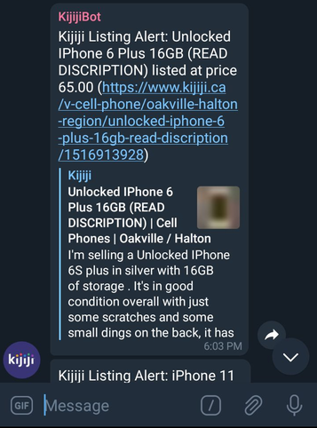

# Kijiji Price Notifier

Small application to receive notifications on low prices from Kijiji.

When running it you must specify a search term for Kijiji and a maximum price. The application will then watch for new listings that are less than the price specfied.

You will receive notifications on Telegram that will appear similar to the following picture.



## How to use

### Parameters

- **--url/SEARCH_URL**: The search of Kijiji to scrape.
- **--token/TELEGRAM_TOKEN**: Telegram bot token.
- **--chatid/TELEGRAM_CHAT_ID**: Chat ID of chat to send notifications to.
- **--max/MAX_PRICE**: Maximum price to look at.

### Docker 

The fastest way to get up and running is to use Docker.

Run the following command, replacing the search term, Telegram token, Telegram chat ID, and maximum price with your own values.

```shell
docker run -d --name kijijinotifier -e SEARCH_URL='https://www.kijiji.ca/b-phone-tablet/ontario/phone/k0c132l9004?ad=offering' -e TELEGRAM_TOKEN='110201543:AAHdqTcvCH1vGWJxfSeofSAs0K5PALDsaw' -e TELEGRAM_CHAT_ID='-348786334' -e MAX_PRICE='100' iamaleks/kijijipricenotifier:latest
```

### Run Directly

Make sure you have Python 3 installed on your system and all the PIP packets that are required.

```shell
./main.py --url https://www.kijiji.ca/b-phone-tablet/ontario/phone/k0c132l9004?ad=offering --token 110201543:AAHdqTcvCH1vGWJxfSeofSAs0K5PALDsaw --chatid -348786334 --max 100
```

### Create Telegram Bot

Please use the following instructions in order to create a Telegram bot.
- https://riptutorial.com/telegram-bot/example/25075/create-a-bot-with-the-botfather


Please use the following instructions in order to add get a Chat ID.
- https://stackoverflow.com/questions/32423837/telegram-bot-how-to-get-a-group-chat-id